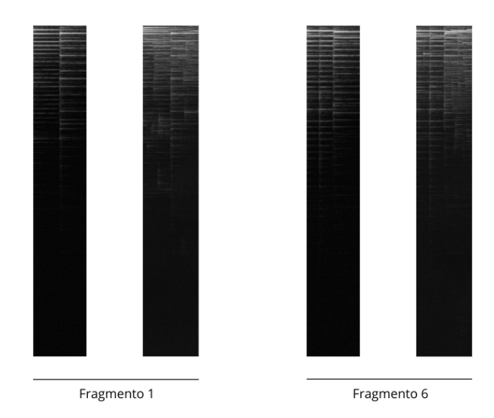

# HerramientaComposicionIA

Este repositorio contiene todo el código empleado para el desarrollo de mi TFG, una herramienta orientada a acompañar al músico en el proceso creativo de composición.

El entrenamiento del modelo se ha realizado con un modelo de difusión y espectrogramas. De manera que los datos de entrada son audios que se transforman a espectrogramas y el modelo devuelve espectrogramas más complejos.

Para la interfaz, se ha implementado un plugin en Musescore.

## Estructura del Proyecto

### Carpetas

- `archivos/`: Contiene ejemplos, de entrada/salida, los modelos definitivos, y los resultados de evaluación de las métricas.ç
- `modelo/`: Contiene todo lo necesario para el entrenamiento y evaluación del modelo. Su origen es el proyecto https://github.com/IGITUGraz/WeatherDiffusion y lo que hay distinto son los archivos de configuración, el dataset, el modelo entrenado y los resultados. El resto de archivos pueden tener ligeras modificaciones pero su origen este ese repositorio.
- `musescore/`: Scripts o configuraciones relacionados con MuseScore.

### Archivos Principales

- `.gitattributes`: Archivo de configuración para Git LFS (almacenamiento de archivos grandes).
- `.gitignore`: Especifica los archivos y carpetas que deben ser ignorados por Git.
- `requirements.txt`: Requerimientos necesarios para la ejecución de esta herramienta.

### Código fuente

- `app.py`: Script que controla la ejecución general del programa para el uso del plugin.
- `main.py`: Script encargado de todas las transformaciones de audio-espectrograma y viceversa.
- `audio_utilities.py`: Funciones para el procesamiento de audio, STFT, espectrogramas, algoritmo Griffin Lim. Su origen es este repositorio: https://github.com/bkvogel/griffin_lim 
- `watcher.py`: Script que espera a que el plugin desde Musescore mande una señal para ejecutar la interfaz.
- `run_musescore.sh`: Script para ejecutar MuseScore desde la terminal.

### Otros archivos

- `Generar sugerencia.qml`: Archivo del plugin para Musescore.
- `README.md`: Este archivo.
- `test.pdf`: Documento PDF de ejemplo de una partitura generada.

---