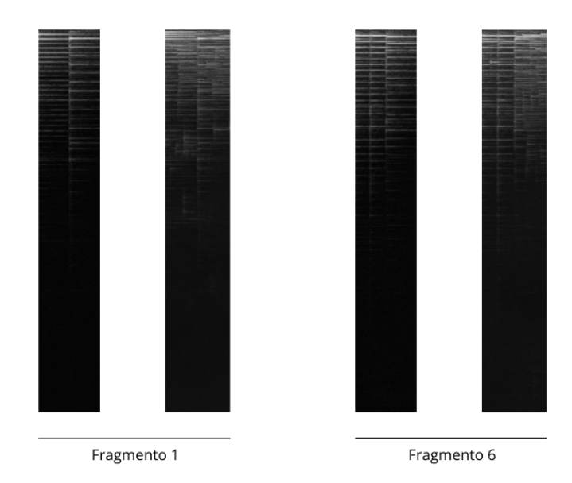

# HerramientaComposicionIA / AI Composition Tool

[Español](#español) | [English](#english)

---

## Español

Este repositorio contiene todo el código empleado para el desarrollo de mi TFG, una herramienta orientada a acompañar al músico en el proceso creativo de composición.

El entrenamiento del modelo se ha realizado con un modelo de difusión y espectrogramas. De manera que los datos de entrada son audios que se transforman a espectrogramas y el modelo devuelve espectrogramas más complejos.

Para la interfaz, se ha implementado un plugin en Musescore, integrando la herramienta en un entorno popular de composición donde los músicos no partan su flujo de trabajo. Todos los detalles de implementación se encuentran en la memoria del TFG.

**Demo**: [Ver vídeo de demostración](archivos/demo.mp4)

## Estructura del Proyecto

### Carpetas

- `archivos/`: Contiene ejemplos, de entrada/salida, los modelos definitivos, y los resultados de evaluación de las métricas.ç
- `modelo/`: Contiene todo lo necesario para el entrenamiento y evaluación del modelo. Su origen es el proyecto https://github.com/IGITUGraz/WeatherDiffusion y lo que hay distinto son los archivos de configuración, el dataset, el modelo entrenado y los resultados. El resto de archivos pueden tener ligeras modificaciones pero su origen este ese repositorio.
- `musescore/`: Scripts o configuraciones relacionados con MuseScore.

### Archivos Principales

- `.gitattributes`: Archivo de configuración para Git LFS (almacenamiento de archivos grandes).
- `.gitignore`: Especifica los archivos y carpetas que deben ser ignorados por Git.
- `requirements.txt`: Requerimientos necesarios para la ejecución de esta herramienta.

### Código fuente

- `app.py`: Script que controla la ejecución general del programa para el uso del plugin.
- `main.py`: Script encargado de todas las transformaciones de audio-espectrograma y viceversa.
- `audio_utilities.py`: Funciones para el procesamiento de audio, STFT, espectrogramas, algoritmo Griffin Lim. Su origen es este repositorio: https://github.com/bkvogel/griffin_lim 
- `watcher.py`: Script que espera a que el plugin desde Musescore mande una señal para ejecutar la interfaz.
- `run_musescore.sh`: Script para ejecutar MuseScore desde la terminal.

### Otros archivos

- `Generar sugerencia.qml`: Archivo del plugin para Musescore.
- `README.md`: Este archivo.
- `test.pdf`: Documento PDF de ejemplo de una partitura generada.

---

## English

This repository contains all the code used for the development of my bachelor's thesis (TFG), a tool designed to assist musicians in the creative process of composition.

The model has been trained using a diffusion model and spectrograms. The input data consists of audio files that are transformed into spectrograms, and the model returns more complex spectrograms.

For the interface, a plugin has been implemented in MuseScore, integrating the tool into a popular composition environment where musicians don't interrupt their workflow. All implementation details can be found in the TFG thesis document.

**Demo**: [Watch the demo](archivos/demo.mp4)

### Project Structure

### Folders

- `archivos/`: Contains input/output examples, final models, and evaluation metric results.
- `modelo/`: Contains everything needed for model training and evaluation. Based on the project https://github.com/IGITUGraz/WeatherDiffusion. The differences are in the configuration files, dataset, trained model, and results. Other files may have slight modifications but originate from that repository.
- `musescore/`: Scripts and configurations related to MuseScore.

### Main Files

- `.gitattributes`: Configuration file for Git LFS (large file storage).
- `.gitignore`: Specifies files and folders to be ignored by Git.
- `requirements.txt`: Requirements needed to run this tool.

### Source Code

- `app.py`: Script that controls the general execution of the program for plugin usage.
- `main.py`: Script responsible for all audio-spectrogram transformations and vice versa.
- `audio_utilities.py`: Functions for audio processing, STFT, spectrograms, Griffin-Lim algorithm. Based on this repository: https://github.com/bkvogel/griffin_lim 
- `watcher.py`: Script that waits for the MuseScore plugin to send a signal to execute the interface.
- `run_musescore.sh`: Script to run MuseScore from the terminal.

### Other Files

- `Generar sugerencia.qml`: MuseScore plugin file.
- `README.md`: This file.
- `test.pdf`: Example PDF document of a generated score.